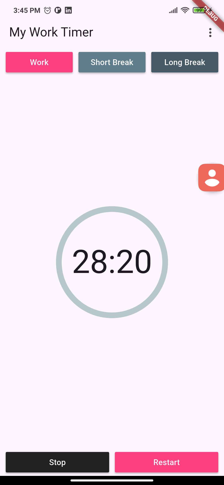
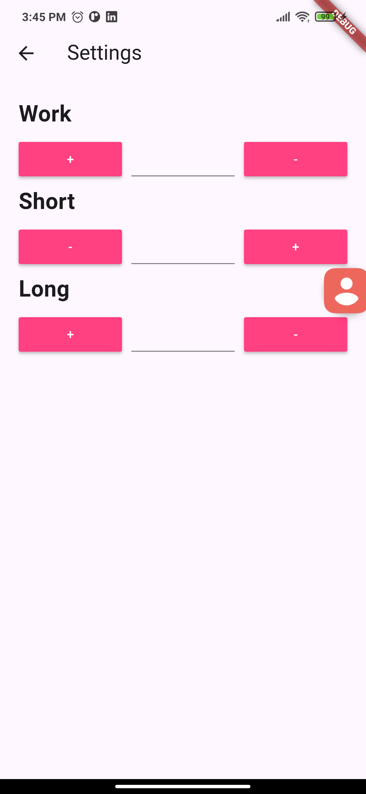

# Productivity Timer

A Flutter productivity app that helps you practice **deep work** by managing work and break intervals. Built with Stream, StreamBuilder, SharedPreferences, and more.

## About The App

This app is designed to help you fight distractions and maximize your cognitive capabilities through **deep work** sessions. Inspired by Cal Newport's book *"Deep Work: Rules for Focused Success in a Distracted World"*, the app allows you to:

- Set custom work and break intervals
- Track your remaining work/break time with a countdown
- Enjoy animated visual feedback
- Persist your preferences using SharedPreferences
- Navigate between screens to configure settings

## Features

- **Countdown Timer** - Visual countdown with animation
- **Customizable Intervals** - Set work time, short break, and long break durations
- **Persistent Settings** - Save your preferences locally
- **Stream & StreamBuilder** - Real-time data updates
- **Clean Navigation** - Simple screen transitions
- **External Libraries** - Leverage community packages

## Tech Stack

- **Framework:** Flutter
- **Language:** Dart
- **State Management:** StreamBuilder
- **Local Storage:** SharedPreferences
- **Navigation:** Navigator 2.0

## Timer image

## Settings

